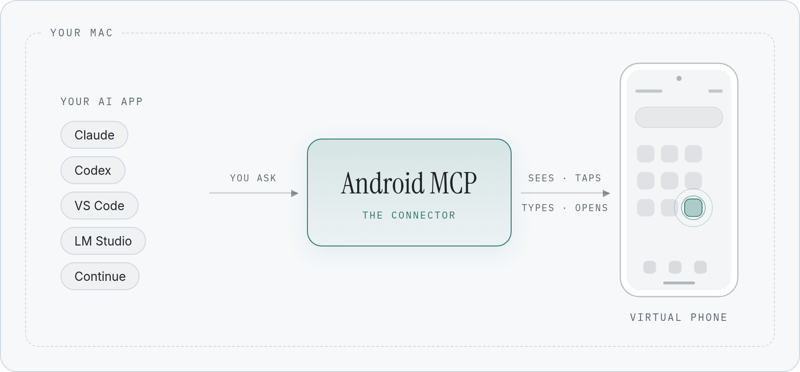
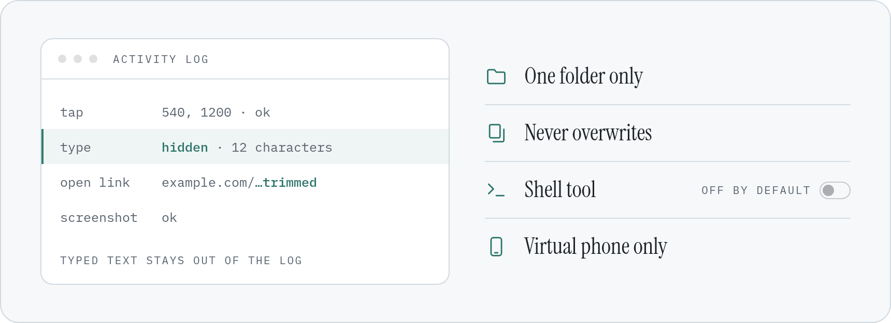

# Android MCP

[](https://github.com/remymazmanian/android-mcp/actions/workflows/tests.yml)
[](LICENSE)

A local [MCP](https://modelcontextprotocol.io) server that lets AI assistants (Claude, Codex,
VS Code, LM Studio, Continue, or any other MCP client) see and drive an Android emulator through
`adb`: screenshots, UI hierarchy dumps, taps, swipes, typing, apps and files.

Built with the official MCP Python SDK (`mcp` 2.x, whose `MCPServer` is the renamed FastMCP) over
the stdio transport.

<p align="center">
  <picture>
    <source media="(prefers-color-scheme: dark)" srcset="docs/images/how-it-works-dark.png">
    <source media="(prefers-color-scheme: light)" srcset="docs/images/how-it-works-light.png">
    
  </picture>
</p>

## Requirements

- macOS with Android Studio; SDK at `~/Library/Android/sdk` (adb in `platform-tools/`, `emulator/`)
- An AVD (default target: `Medium_Phone`, which matches `Medium_Phone_API_37.0` by prefix)
- [uv](https://docs.astral.sh/uv/) (`brew install uv`); it provides Python 3.12+ and the dependencies

## Setup

```bash
mkdir -p ~/agent-tools && cd ~/agent-tools
git clone https://github.com/remymazmanian/android-mcp.git
cd android-mcp
uv sync
```

The snippets below assume the repo lives at `~/agent-tools/android-mcp`; adjust the path if you
cloned it somewhere else.

Run command (what the MCP clients launch):

```bash
uv --directory ~/agent-tools/android-mcp run android-mcp
```

## Connecting it to apps

Any MCP client that can launch a local (stdio) server can use it. GUI apps don't inherit your
shell's PATH or expand `~`, so the snippets use absolute paths: replace `YOU` with your macOS
username, and check the uv path with `which uv`. Restart the app after editing its config.

### Claude desktop app

`~/Library/Application Support/Claude/claude_desktop_config.json`, under `mcpServers`:

```json
"android": {
  "command": "/opt/homebrew/bin/uv",
  "args": ["--directory", "/Users/YOU/agent-tools/android-mcp", "run", "android-mcp"]
}
```

### Claude Code

```bash
claude mcp add -s user android -- uv --directory ~/agent-tools/android-mcp run android-mcp
```

`-s user` makes it available in every project; leave it out to register it for the current project only.

### Codex (CLI and the ChatGPT desktop app)

`~/.codex/config.toml`:

```toml
[mcp_servers.android]
command = "/opt/homebrew/bin/uv"
args = ["--directory", "/Users/YOU/agent-tools/android-mcp", "run", "android-mcp"]
startup_timeout_sec = 60
```

### LM Studio

`~/.lmstudio/mcp.json`, under `mcpServers`: the same entry as for the Claude desktop app.

### VS Code (Copilot agent mode)

`~/Library/Application Support/Code/User/mcp.json`:

```json
{
  "servers": {
    "android": {
      "type": "stdio",
      "command": "/opt/homebrew/bin/uv",
      "args": ["--directory", "/Users/YOU/agent-tools/android-mcp", "run", "android-mcp"]
    }
  }
}
```

### Continue

`~/.continue/config.yaml` (MCP tools are used in Agent mode):

```yaml
mcpServers:
  - name: android
    command: /opt/homebrew/bin/uv
    args:
      - --directory
      - /Users/YOU/agent-tools/android-mcp
      - run
      - android-mcp
```

## Configuration (environment variables)

| Variable | Default | Meaning |
|---|---|---|
| `ANDROID_ADB` | `~/Library/Android/sdk/platform-tools/adb` | adb binary to use |
| `ANDROID_EMULATOR` | `~/Library/Android/sdk/emulator/emulator` | emulator launcher used by `start_emulator` |
| `ANDROID_SERIAL` | unset | Device to control. Unset: the first running `emulator-*` device (lowest port). Physical devices are only used when named here. |
| `ANDROID_MCP_ALLOW_SHELL` | unset | Set to `1` to enable the `shell` tool |
| `ANDROID_MCP_FILES_DIR` | `~/android-mcp-files` | The only Mac folder `push_file`, `pull_file` and `install_apk` may use (created if missing) |

Set them in the `env` block of the client config, e.g. `"env": {"ANDROID_MCP_ALLOW_SHELL": "1"}`.

## Coordinates

All `x`/`y` arguments are **full-resolution device pixels**, origin top-left, in the current
orientation (1080x2400 on Medium Phone). `ui_dump` reports element `center`s in that frame, so they
can be passed straight to `tap`. `screenshot` returns a downscaled image (default `scale=0.5`) along
with the scale and full resolution: `full = image_px / scale`.

## Tools

| Group | Tool | What it does |
|---|---|---|
| Device | `list_devices` | `adb devices -l`, plus which device is selected |
| | `start_emulator(avd="Medium_Phone", boot_timeout=180)` | Launches the AVD detached and waits for `sys.boot_completed == 1`; returns at once if it is already running |
| | `stop_emulator` | `adb emu kill` on the selected emulator (refuses physical devices) |
| | `device_info` | Model, Android version/SDK, `wm size`, `wm density`, AVD name |
| Screen | `screenshot(scale=0.5, image_format="jpeg")` | `screencap -p`, downscaled with Pillow, returned as an MCP image plus scale/size metadata |
| | `ui_dump` | `uiautomator dump`, parsed to one compact JSON element per line: index, text, desc, resource_id, class, clickable, bounds, center (+ `label` for clickable containers, and state flags) |
| Input | `tap(x, y)` | Tap at full-resolution coordinates (bounds-checked) |
| | `tap_element(text, desc, resource_id, index)` | Fresh dump, find the element (exact > substring > child label), tap its center; errors list the closest matches |
| | `long_press(x, y, ms=800)` | Press and hold |
| | `swipe(x1, y1, x2, y2, ms=300)` | Swipe gesture |
| | `scroll(direction="down")` | Half-screen swipe from the center; `down` reveals content further down |
| | `type_text(text)` | `input text` with spaces (`%s`), literal `%s`, and shell-special characters escaped; `\n`/`\t` press Enter/Tab |
| | `press_key(key)` | back, home, recents, enter, delete, tab, volume_up/down, power, and more (or any `KEYCODE_*` name or number) |
| | `wait(seconds)` | Sleep up to 60 s |
| | `wait_for_element(text, desc, resource_id, timeout=15)` | Polls `ui_dump` until a match appears |
| Apps | `list_packages(filter=None, third_party_only=False)` | `pm list packages` |
| | `launch_app(package)` | `monkey -p <pkg> -c android.intent.category.LAUNCHER 1` |
| | `force_stop(package)` | `am force-stop` |
| | `current_app` | Foreground package/activity and focused window |
| | `install_apk(path)` | `adb install -r` of an APK in the files folder |
| | `open_url(url)` | `am start -a android.intent.action.VIEW -d <url>` |
| Files | `push_file(local_path, remote_dir="/sdcard/Download/")` | `adb push` from the files folder, then a media scan (`MEDIA_SCANNER_SCAN_FILE` broadcast, falling back to MediaProvider `scan_file`) and a MediaStore check, so the file shows up in gallery pickers right away |
| | `pull_file(remote_path, local_dir=None)` | `adb pull` into the files folder (or a subfolder of it) |
| | `list_files(remote_dir="/sdcard/Download/")` | `ls -la`, parsed |
| Escape hatch | `shell(command, timeout=30)` | `adb shell <command>`; disabled unless `ANDROID_MCP_ALLOW_SHELL=1` |

## Safety

<picture>
  <source media="(prefers-color-scheme: dark)" srcset="docs/images/safety-dark.png">
  <source media="(prefers-color-scheme: light)" srcset="docs/images/safety-light.png">
  
</picture>

- Every adb call is `subprocess.run` with an argument list (never `shell=True`), a timeout, and
  `-s <serial>` for the one selected device. Values that reach the device shell are quoted; package
  names are validated.
- **Files sandbox.** The Mac-side file tools only work inside one folder: `ANDROID_MCP_FILES_DIR`,
  default `~/android-mcp-files` (created if missing). `push_file` and `install_apk` only read from it,
  and `pull_file` only writes into it (its default destination). Relative paths are relative to the
  folder. Paths are resolved with symlinks followed, so `../` traversal and links pointing outside are
  refused, as are pushed folders containing such links. This stops a prompt-injected assistant from
  copying e.g. `~/.ssh` to the device or dropping files elsewhere on the Mac.
- Nothing on the Mac is deleted or overwritten: `pull_file` saves as `name (1).ext` when the name is
  taken. On the device, `push_file` also never overwrites, and deleting files is only possible
  through `shell`, which is off by default.
- Every tool call is appended to `logs/actions.log` (timestamp, tool, arguments, ok/error, duration,
  result summary). Sensitive arguments are redacted there and in error messages:
  - `type_text`: the text is never logged, only `[redacted N chars]` (it may be a password).
  - `open_url`: only scheme and host are kept, e.g. `https://example.com/[redacted 23 chars]`, because
    paths and query strings often carry login or reset tokens.
  - `shell`: logged verbatim on purpose. It is the one tool that can delete or change anything on the
    device, so the audit log must show exactly what ran. Don't pass secrets through it.

  Emulator output from `start_emulator` goes to `logs/emulator.log`.

## Limitations

- **Non-ASCII typing.** `adb shell input text` only sends ASCII. For emoji, accented letters, CJK or
  curly quotes, `type_text` falls back to `cmd clipboard` + paste, but stock emulator images
  (including Android 17 / API 37) don't implement `cmd clipboard`. On those, `type_text` returns an
  error and types nothing. Workarounds: use ASCII, or install an IME such as ADBKeyBoard and
  use it via `shell`.
- `ui_dump` takes about 2 s (uiautomator's cost) and can fail briefly during animations (it retries
  3 times). Screens marked secure (`FLAG_SECURE`, e.g. some banking or password screens) show up black
  in screenshots.
- `index` in `tap_element` refers to the latest dump; prefer text/desc/resource_id when the screen
  may have changed.

## Smoke test

With the emulator running:

```bash
uv --directory ~/agent-tools/android-mcp run python scripts/smoke_test.py
```

It starts the server over stdio, like an MCP client does, and runs: list devices -> screenshot -> UI dump ->
home -> open Settings -> find and tap "Network & internet" -> back, checking each step. The
screenshot is saved to `logs/smoke_screenshot.jpg`. Note that it force-stops and reopens Settings.

## Unit tests

No emulator needed: adb is faked, and the action log, files folder and `$HOME` are redirected to
temporary folders, so the tests never touch your device or your real files.

```bash
uv --directory ~/agent-tools/android-mcp run pytest
```

## License

[MIT](LICENSE) © 2026 Remy Mazmanian
